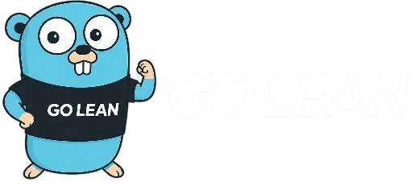

<p align="center">
  
</p>

<h1 align="center">Go Lean SDD</h1>

<p align="center"><strong>The leanest path that still ships tested code.</strong></p>

<p align="center">A spec-driven development framework for AI coding agents, packaged as a Claude Code skill.</p>

<p align="center">
  
  
</p>

---

Go Lean SDD turns a request or PRD into working, tested code. It sizes the process to the task instead of running the same ceremony on every change. A one-line fix gets one line of spec. A multi-component feature earns a full spec, a design, and a task breakdown.

## Why it exists

Spec-driven frameworks tend to grow heavy. You get directory trees, status files, and multi-step rituals applied to every change, whether it is a typo fix or a new subsystem.

A benchmark of four popular SDD frameworks pointed the other way. A strong model given nothing but a good `AGENTS.md` scored 0.89, matching the best framework while spending fewer tokens. That result shaped this skill: a capable model does better with clear, tight instructions than with heavy scaffolding. Go Lean SDD is built around that idea.

## What it does

The skill sizes planning to the task. Complexity earns depth, so trivial and medium work stays in the conversation and only a large feature writes anything to disk.

Tests are not optional here. Every change ships with co-located tests, and a discrimination check then mutates the new code to confirm a test actually fails. That is how you tell a test that catches regressions from one that only looks green.

It also keeps the repo clean. There is no scaffolding tree and no status file to go stale, just a single `AGENTS.md` that holds the durable context. Before writing new code, the skill climbs a reuse ladder through your project, your dependencies, the standard library, the framework, and the platform, and it writes something new only when nothing above it fits.

## Install

```sh
git clone https://github.com/enzodevs/go-lean-sdd.git ~/.claude/skills/go-lean-sdd
```

Restart your session. The skill loads on its own when you plan, build, or verify a change, and you can also call it as `/go-lean-sdd`.

## How it works

Four phases, applied only as deep as the task earns:

| Scope | Specify | Design | Tasks | Execute |
|---|---|---|---|---|
| Trivial (3 files or fewer, one sentence) | one line, inline | skip | skip | implement and test |
| Medium (clear feature, under 10 steps) | brief, with edge cases | inline | implicit | implement and test each step |
| Large (multi-component or ambiguous) | full, with requirement IDs | approach and reuse | atomic breakdown | implement, test, and verify each task |

Specify and Execute always run. Design and Tasks switch on only when the work needs them. The full skill lives in [`SKILL.md`](SKILL.md), and the deeper guidance loads on demand from [`references/`](references/).

## Credits

Go Lean SDD distills a public benchmark of spec-driven development frameworks, run by Waldemar Neto, down to the parts that earned their keep: auto-sizing, strict test enforcement, tight scope control with delta specs, early surfacing of unknowns, interface contracts, and the reuse-first build ladder.

The logo features the Go gopher, a mascot created by [Renée French](https://reneefrench.blogspot.com/) and licensed under [CC BY 3.0](https://creativecommons.org/licenses/by/3.0/).

## License

[Creative Commons Attribution 4.0 International](LICENSE) (CC BY 4.0). You can share, adapt, and build on it, including commercially, as long as you credit "Go Lean SDD by rrghost" and link the license.
