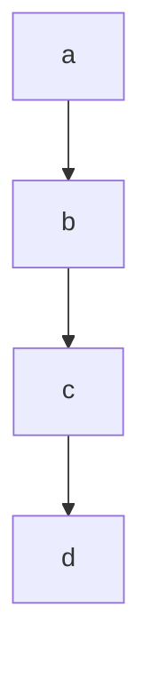
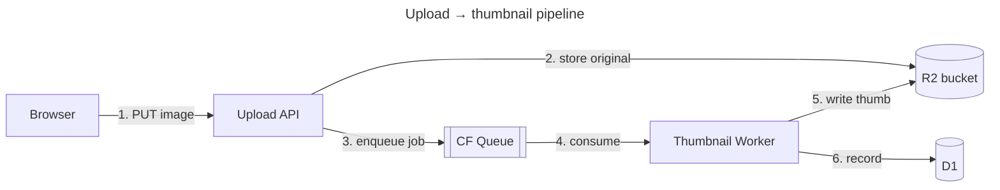

# Diagrams reference — readable Mermaid, not noise

Loaded on demand from the DESIGN phase. The goal: diagrams a **human** can read at a glance,
not a tangle the model emitted to look thorough. If a diagram doesn't make something clearer than
prose would, don't draw it.

## Pick the right type

| Intent | Type | Use when |
|---|---|---|
| System / module layout | `flowchart` (LR or TB) | "what talks to what" — services, modules, datastores |
| Request / data path | `flowchart LR` with labeled edges | tracing a flow end to end (ByteByteGo style) |
| Time-ordered interaction | `sequenceDiagram` | call order across components, async steps |
| Lifecycle / status | `stateDiagram-v2` | a thing that moves through states |
| Data shape | `erDiagram` | entities + relationships, schema |

## Quality rules (this is where agents fail)

1. **Every edge is labeled** with what flows or why — `-->|publishes job|`, not a bare `-->`. An unlabeled arrow is a question mark.
2. **Readable node names, not IDs** — `Worker[Image Worker]`, never `n1`. Keep the short id, give it a real label.
3. **Group by boundary** with `subgraph` — one subgraph per deployment unit / trust zone / package. This is what makes architecture legible.
4. **One view = one idea.** Cap at ~12–15 nodes. If it's bigger, split into an overview + zoom-ins, don't cram.
5. **Set a direction deliberately** — `LR` for pipelines/request paths, `TB` for hierarchies. Don't let it default.
6. **Annotate the non-obvious** — caching, retries, async, scaling, auth boundaries. A `note` or edge label beats a comment the reader can't see.
7. **Mark managed vs. hand-built explicitly** — if a box is a managed product (a queue, KV store, object store, managed DB, etc.), style/label it as such. It documents the reuse-first choice and shows at a glance what's *not* your code to maintain.
8. **Consistent naming** with the spec/code — the diagram's `AuthService` is the spec's `AuthService`.

## Metadata that makes it land

- Give the diagram a `title` (front matter or a heading above it).
- Style to convey meaning, sparingly: `classDef external fill:#eee,stroke-dasharray:5` for third-party/managed, a distinct fill for the datastore tier. Don't rainbow it.
- For request paths, number the hops (`1. `, `2. `) so the order is unambiguous.

## Good vs. bad (flowchart)

Bad — unlabeled, no grouping, cryptic:

Good — boundaries, labels, platform primitives marked:

## Verify it renders

Don't ship a diagram you haven't rendered — broken Mermaid is worse than none.
- Zed Mermaid extension (preview the block), or [mermaid.live](https://mermaid.live), or
- if the `mermaid-studio` skill is installed, delegate rendering/validation/theming to it (SVG/PNG export).
